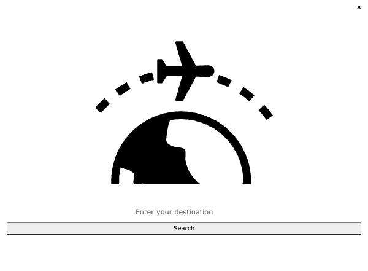
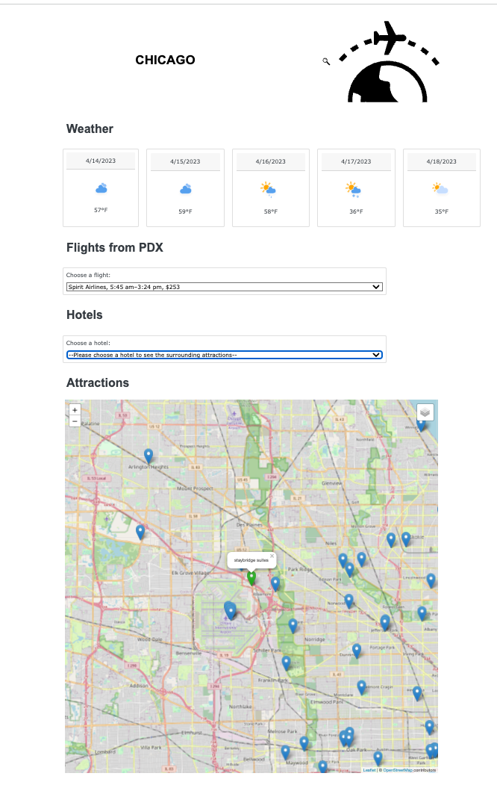

# project-3

## Background

Elisangela is going to Chicago in July 2023, so we decided to help her planning her vacation. 

## Created using

* HTML v5
* CSS v3
* JavaScript v1.8.5
* Bootstrap v4.3.1
* Leaflet
* [amcharts](https://www.amcharts.com/free-animated-svg-weather-icons/)
* Python
* Pandas 
* Flask 
* Jupyter Notebook

## API used
 * https://openweathermap.org/forecast16
 * https://openweathermap.org/weather
 * https://api.geoapify.com/v2/places
 * https://www.kayak.com/affiliate/help/widget
 * https://www.tripadvisor.com/developers

## Contribution

Created by:

* [Elisangela Jardim](https://github.com/ElisJardim)

* [Geetha Rajendram](https://github.com/Geetraje)

* [Justin DeMaagd](https://github.com/DeMaagdJ)

* [Kurt Goesch](https://github.com/KurtGoesch)

## References

* https://getbootstrap.com/
* https://getbootstrap.com/docs/3.4/css/
* https://flask.palletsprojects.com/en/2.2.x/
* https://www.tripadvisor.com/HotelsNear-g35805-qORD-Chicago_Illinois.html'
* https://leafletjs.com/reference.html#divicon-option
* https://python-web.teclado.com/section07/lectures/06_jinja2_conditional_statements/
* https://www.studytonight.com/python-howtos/how-to-check-if-a-variable-exists-in-python
* https://www.programiz.com/python-programming/if-elif-else
* https://www.w3schools.com/tags/att_option_selected.asp
* https://leafletjs.com/examples.html
* https://stackoverflow.com/questions/41590102/change-leaflet-marker-icon
* https://help.openstreetmap.org/questions/12935/error-map-container-is-already-initialized
* https://groups.google.com/g/leaflet-js/c/xvZ1V6shL8M?pli=1

## Screenshots

